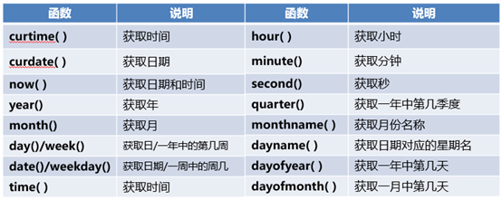
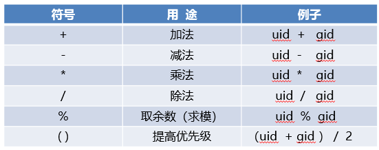
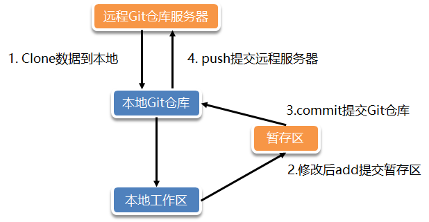

# Linux软件安装配置使用

## MySQL(MariaDB)

#### 安装

CentOS 7默认使用MariaDB作为MySQL的一个替代品，可以直接通过yum安装：

```bash
yum install mariadb-server mariadb -y
systemctl enable mariadb --now
```

#### 使用命令

```bash
## 数据库管理员设置密码
mysqladmin  -uroot -p  password "tarena"
## 创建数据库
mysql -e "create database db_blog character set utf8mb4"
## 创建用户
mysql -e "create user root@'%' identified by '123456'"
## 赋予用户对于数据库的权限
mysql -e "grant all privileges on root.* to root@'%'"
```

#### 配置文件

```bash
[root@database ~]# cat /etc/my.cnf
[client-server]
!includedir /etc/my.cnf.d

[root@database ~]# cat /etc/my.cnf.d/mysql-server.cnf
[mysqld]
datadir=/var/lib/mysql  ##指定 MySQL 存放数据库文件的目录
socket=/var/lib/mysql/mysql.sock ##指定本地连接时使用的 socket文件路径
log-error=/var/log/mysql/mysqld.log ##指定 MySQL 错误日志文件的路径
pid-file=/run/mysqld/mysqld.pid ##主进程PID的文件路径。
bind-address = 127.0.0.1  ##限制了 MySQL 只能接受来自本机的连接。将它改为 0.0.0.0 允许所有 IP 地址连接，或者直接注释掉这一行
skip_grant_tables ##跳过密码验证
```

#### 常用函数

时间函数



字符函数

```sql
SELECT length('abc'),char_length('abc');
SELECT LENGTH('你好'),CHAR_LENGTH('你好');
SELECT upper('abc'),ucase('abc');
SELECT lower('ABC'),lcase('ABC');
SELECT SUBSTR(name,2,3) from tarena.employees where employee_id <3;
SELECT SUBSTR(name,2,3) from tarena.employees where employee_id > 10;
SELECT instr('hello','e'),instr('hello','a');
SELECT TRIM('    a       ');
```

数学函数

```sql
##返回x的绝对值
select abs(-11);
##PI() 返回圆周率π，默认显示6位小数
select pi() ;
##MOD(x,y) 返回x被y除后的余数
select mod(10,3);
##CEIL(x)、CEILING(x) 返回不小于x的最小整数 (x 是小数)
select ceil(9.23);
select ceiling(9.23);
select floor(9.23); ##返回不大于x的最大整数 (x 是有小数的数字)
```

聚集函数

```sql
sum(表头名) 求和
avg(表头名) 计算平均值
min(表头名) 获取最小值
max(表头名) 获取最大值
count(表头名) 统计表头值个数
```

数学计算



if函数

if(条件,v1,v2) 如果条件是TRUE则返回v1，否则返回v2

ifnull(v1,v2) 如果v1不为NULL，则返回v1，否则返回v2

## Redis

#### yum安装

```bash
yum -y install  redis
systemctl start redis
```

```bash
# 服务启动
systemctl restart redis-server  # Ubuntu系统
systemctl restart redis   # centos系统

# 测试连接
redis-cli -a my_password
```

#### 源码安装

```bash
# 下载
wget http://download.redis.io/releases/redis-6.2.6.tar.gz
# yum -y install gcc make
tar xf redis-6.2.6.tar.gz
cd redis-6.2.6/
make && make install PREFIX=/usr/local/reids/

mkdir /usr/local/redis/{conf,logs,data}
cp redis.conf /usr/local/redis/conf
cd /usr/local/redis/

# 修改redis配置文件
vim conf/redis.conf
sed -rn '75p;94p;257p;289p;302p;454p;901p' conf/redis.conf
bind 0.0.0.0
protected-mode no
daemonize yes
pidfile /usr/local/redis/logs/redis.pid
logfile "/usr/local/redis/logs/redis.log"
dir /usr/local/redis/data/
requirepass 123456

# 配置redis运行脚本
vim redis
#!/bin/bash
REDIS_SERVER="/usr/local/redis/bin/redis-server"
REDIS_CONF="/usr/local/redis/conf/redis.conf"
REDIS_PORT=6379
PID_FILE="/usr/local/redis/logs/redis.pid"
case $1 in
status)
if [ -e "${PID_FILE}" ];then
echo "Redis is Running..."
else
echo "Redis is not Running..."
fi
;;
start)
if [ -e "${PID_FILE}" ];then
echo "Redis is Running..."
exit 11
fi
${REDIS_SERVER} ${REDIS_CONF} &> /dev/null
sleep 2
if [ -e "${PID_FILE}" ];then
echo "Redis Starting..."
else
echo "Redis Start Failed, Please Check in Manual..."
fi
;;
stop)
if [ -e "${PID_FILE}" ];then
pkill redis-server
else
echo "Redis is not Running..."
fi
;;
restart)
if [ -e "${PID_FILE}" ];then
pkill redis-server
fi
${REDIS_SERVER} ${REDIS_CONF}
;;
*)
echo "Usage $0 {status|start|stop|restart}"
esac

# 启动redis运行脚本
chmod +x redis
./redis start

```

#### 配置文件

Redis 的配置文件通常位于 /etc/redis/redis.conf 或 /etc/redis.conf，具体取决于你的操作系统和安装方式。

```bash
bind 127.0.0.1  #配置是否只监听本地连接
protected-mode yes  #配置保护模式
requirepass my_password #配置密码
```

## Git软件安装使用

```bash
# 1、配置中文支持
yum -y install langpacks-zh_CN.noarch
cat /etc/locale.conf
LANG="zh_CN.UTF-8"
# 2、git安装
yum -y install git
git --version
git --help
```

#### 工作流程



#### Git基础配置

```bash
#Git基础配置
    # --local:  仓库级（仓库目录下.git/config）
    # --global: 全局级（~/.gitconfig）
    # --system: 系统级（/etc/gitconfig）
git config --global user.name mark              #设置用户名
git config --global user.email mark@tedu.cn     #设置用户邮箱
git config --global init.defaultBranch master   #设置版本库默认分支

[root@Programer ~]# git config --list                               #查看已有Git配置
user.name=mark
user.email=mark@tedu.cn
init.defaultbranch=master
[root@Programer ~]# cat ~/.gitconfig                                #查看Git配置持久化文件
[user]
        name = mark
        email = mark@tedu.cn
[init]
        defaultBranch = master
[root@Programer ~]#
```

##### Git版本库操作

```bash
git init myproject  #初始化空版本库

[root@Programer ~]# cd mytest/
[root@Programer mytest]# git init                     #将已有目录制作成Git版本库


git status  #查看Git本地仓库状态
git add readme.md  #将文件信息添加到暂存区
git commit -m "add readme"          #将暂存区文件提交到本地仓库

git log   #本地版本库提交记录（详细）
git log --pretty=oneline            #本地版本库提交记录（简略）
git log --oneline                   #本地版本库提交记录（极简）
```

##### Git指针操作

```bash
git reset --hard 58cdf7905a     #还原到指定版本
git reflog
```

##### Git分支操作

```bash
git branch -v                   #查看分支信息
git branch hotfix               #创建hotfix分支
git branch feature              #创建feature分支
git checkout hotfix             #切换分支
git branch -d develop           #删除develop分支
## Git合并分支
#无冲突分支合并

#有冲突分支合并（修改不同分支中相同文件的相同行）
git merge hotfix                #合并hotfix分支到master分支

git checkout --ours -- 运维阶段二/Ansible.md # 使用原本的分支
git checkout --theirs -- 运维阶段二/Ansible.md #使用合并过来的分支

```

#### git远程推送

```bash
git add.
git commit -m "2025/05/15"
git remote add origin https://gitee.com/dsa772819sad/ops-note-taker.git
git push -u origin "master"

# origin 默认远程仓库名称
# -u或 --set-upstream: 这个选项创建了一个上游分支跟踪关系。这意味着之后你只需要运行 git push 而不需要指定远程仓库名和分支名，Git 会知道你要推送哪个本地分支到哪个远程分支运行 git pull 时，Git 也会知道从哪个远程分支拉取更新。

```

## GitLab安装使用

```bash
#安装GitLab软件包,强制忽略依赖安装
[root@GitLab ~]# rpm -ivh --nodeps gitlab-ce-12.4.6-ce.0.el7.x86_64.rpm
#重载GitLab配置（需要耐心等待）
[root@GitLab ~]# gitlab-ctl reconfigure
...
#重启GitLab相关服务
[root@GitLab ~]# gitlab-ctl restart

#GitLab主机确认80端口被监听
#浏览器访问： http://192.168.88.20/
```

## Jenkins安装使用

```bash
#Jenkins主机安装OpenJDK11环境
[root@Jenkins ~]# yum -y install java-11-openjdk-devel.x86_64
#安装工具相关软件(Git用于拉取代码、postfix用于发邮件)
[root@Jenkins ~]# yum -y install git postfix
#安装jenkins软件包
[root@jenkins ~]# yum -y jenkins-2.361.4-1.1.noarch.rpm

#启动Jenkins服务
[root@Jenkins ~]# systemctl enable jenkins.service              #设置Jenkins开机自启动
[root@Jenkins ~]# systemctl start jenkins.service               #启动Jenkins服务器
[root@Jenkins ~]# ss -antpul | grep java                        #确认8080端口被监听
tcp   LISTEN 0      50     *:8080     *:*    users:(("java",pid=13602,fd=8))

#获取Jenkins初始密码
[root@Jenkins ~]# cat /var/lib/jenkins/secrets/initialAdminPassword
1aaf609acf3843a8aaf17e8b1f22e8ea

#浏览器访问： http://192.168.88.30:8080/

#离线部署Jenkins插件
[root@Jenkins ~]# ls /var/lib/jenkins/plugins/            #空目录，没有任何插件

#解压Jenkins插件，保留文件归属(-P绝对路径解压，-p保留权限)
[root@Jenkins ~]# tar -xPpf PROJECT02/Jenkins/jenkins_plugins.tar.gz -C /

[root@Jenkins ~]# ls -l /var/lib/jenkins/plugins/               #确认该目录下文件归属
```

## Zabbix安装配置

```yml
[root@pubserver zabbix]# vim 02-inst-zabbix.yml
---
- name: install zabbix
  hosts: zabbix
  tasks:
    - name: install zabbix    # 安装软件包
      yum:
        name:
          - zabbix-server-mysql
          - zabbix-web-mysql
          - zabbix-nginx-conf
          - zabbix-sql-scripts
          - zabbix-selinux-policy
          - zabbix-agent
          - mysql-server
          - langpacks-zh_CN
        state: present
```

## docker安装使用

```bash
# 添加 Docker 的官方仓库
sudo yum-config-manager --add-repo https://download.docker.com/linux/centos/docker-ce.repo

yum install docker-ce -y
yum install docker-compose-plugin -y

vim /etc/docker/daemon.json
{
  "registry-mirrors":["https://docker.xuanyuan.me"]
}
systemctl enable --now docker

```

```bash
## 卸载
yum remove docker docker-common docker-selinux docker-engine -y

## 更新 yum 源
curl -o /etc/yum.repos.d/CentOS-Base.repo https://repo.huaweicloud.com/repository/conf/CentOS-7-reg.repo
yum -y install https://repo.huaweicloud.com/epel/epel-release-latest-7.noarch.rpm
sed -i "s/#baseurl/baseurl/g" /etc/yum.repos.d/epel.repo
sed -i "s/metalink/#metalink/g" /etc/yum.repos.d/epel.repo
sed -i "s@https\?://download.fedoraproject.org/pub@https://repo.huaweicloud.com@g" /etc/yum.repos.d/epel.repo

yum clean all
yum makecache

# 添加 docker-ce yum 源
wget -O /etc/yum.repos.d/docker-ce.repo https://repo.huaweicloud.com/docker-ce/linux/centos/docker-ce.repo

# 添加加速器
mkdir -p /etc/docker
tee /etc/docker/daemon.json <<-'EOF'
{
	"registry-mirrors":["https://qi3pe2q2.mirror.aliyuncs.com"]
}
EOF
systemctl daemon-reload

## docker
yum install docker-ce -y
yum install docker-compose -y

systemctl start docker
systemctl enable docker

docker info
docker version
```

### docker常用命令

官方仓库 hub.docker.com

自己私有仓库 Harbor

阿里云私有仓库 registry.cn-hangzhou.aliyuncs.com

镜像操作命令

```bash
# docker 镜像命令
docker  search [镜像名称]
	-f #晒选
docker 	pull   [镜像名称]

docker  push   [镜像标签]

docker  load  < [包名称]

docker  save [镜像名称|镜像ID]

docker	rmi  [镜像名称|镜像ID]
	-f #强制删除
docker  tag  [镜像ID]  镜像标签

docker  images ls
	-q #只显示镜像ID
docker  images prune  #删除未指定的映像
	-a #删除所有

docker  inspect [镜像名称|镜像ID]
	-f # 格式化输出
docker  login      #登陆镜像仓库，默认是官方，可以指定其他URL
	--username|-u 用户名
	--password|-p 密码

docker  history  [镜像ID|镜像名称] #查看镜像构建历史

docker  commit [容器ID|容器名称] 保存名称：版本 # 保存正在运行的容器为镜像
	-a 镜像作者
	-p 提交期间暂停容器
	-m 容器说明

docker  export [容器ID] > [包名称] #保存正在运行的容器为镜像包

docker  save  [镜像名称|镜像ID] > [包名称]  #保存镜像为镜像包
```

容器操作命令

```bash
# docker 容器命令
docker ps [参数] #查看正在运行的容器列表
	-a 查看系统中所有的容器
	-q 仅显示容器的ID

docker run [参数] [镜像名称] [运行容器的启动命令]
	-d 守护进程方式运行
	-name  指定容器名称
	-p	指定端口映射
	-P  随机端口映射
	-it 以交互式方法打开一个伪终端
	-dit 在后台运行伪终端
	-v 主机目录:容器目录  #给容器挂载数据卷
	--rm   #容器退出后立即删除
	-e 环境变量  #在容器中创建环境变量
	--link	#连上一个容器，实现网络互通
	-h "主机名"  # 设置容器主机名

docker create [参数] [镜像名称] [运行容器的启动命令]
	-参数与run 相同，但是没有 -d

docker  start|stop [容器ID|名称]

docker  rm [容器ID|名称]
	-f 强制删除

docker inspect [容器ID|名称]
	-f '{{信息名称}}' #指定信息名称

docker cp [主机文件]  容器ID:容器文件

docker cp 容器ID:容器文件  [主机文件]

docker  exec/attach	-it [容器名称] sh #进入容器

nsenter : 建立一个管道连接上容器主ID

```

```bash
# docker 网桥相关命令
docker network ls  #查看网桥

docker network create  [网桥名称]    #创建网桥

docker network inspect [网桥名称|ID] #查看网桥名称

docker network  connet  [网络名称] [容器名称] # 添加容器网络到网桥中

docker network  disconnet  [网络名称] [容器名称]  #断开容器与网桥的连接

docker network  rm  [网桥名称]  #删除网桥

docker network  prune    #清除网桥

```

### Dockerfile

```
docker build -t .
```

```yml
from  指定基础镜像

maintainer  指定维护者信息

run	  对指定镜像运行指令，结果反映到新镜像

CMD   指定容器运行的默认命令
CMD	["/usr/sbin/php-fpm","-c","/etc/php-fpm.d/www.conf"]
CMD ["nginx","-g","daemon off;"]

ADD : 将本地文件添加到镜像
	ADD 支持自动解压，但是仅仅支持解压tar包
	ADD 支持远程下载，但不会解压下载的内容

COPY 将文件复制到镜像

ENV 设置一个容器的环境变量

EXPOSE  指定容器需要向外界暴露的端口

ARG 指定运行时参数

volume	提示需要挂载的目录，实际没有挂载

workdir 设置工作目录
程序运行的开始目录
进入容器的最初目录

onbuild
构建触发器:当前镜像会被用作基础镜像时触发

```

### compose

```yaml
services:
  nginx:
    image: myos:nginx
    container_name: nginx
    restart: always
    volumes:
      - type: bind
        source: /root/websvc/nginx.conf
        target: /usr/local/nginx/conf/nginx.conf
      - type: bind
        source: /var/webroot
        target: /usr/local/nginx/html
      - type: bind
        source: /var/weblog
        target: /usr/local/nginx/logs
    network_mode: bridge
    ports:
      - 80:80
  php-fpm:
    image: myos:php-fpm
    container_name: php-fpm
    restart: always
    volumes:
      - type: bind
        source: /var/webroot
        target: /usr/local/nginx/html
    depends_on:
      - nginx
    network_mode: "container:nginx"
```

```bash
docker compose -f docker-compose.yaml up -d
```

```bash
[root@wordpress ~]# docker network create --driver bridge --subnet=192.168.0.0/16 --gateway=192.168.88.1 wordpress
4652c2d85fa9b3a43806d238b26ac664f3a6e9320d454fb21b9d098764a271ee


```

## OpenEuler系统的Finalshell安装

[www.hostbuf.com/downloads/;](https://www.hostbuf.com/downloads/finalshell_install_linux.sh;)下载对应安装包

安装alien

http://ftp.de.debian.org/debian/pool/main/a/alien/ ; alien安装网址，选择.tar.xz后缀，解压到桌面; cd 进入到alien文件中，执行命令

```bash
perl Makefile.PL
make
sudo make install
which alien  //查看是否安装成功
```

安装rpmbuild ;

```
错误信息 sh: line 1: rpmbuild: command not found 表明系统中没有安装 rpmbuild 工具。执行下面命令安装

sudo dnf install rpm-build
```

使用 alien 转换 .deb 文件：

```bash
sudo alien --to-rpm finalshell_linux_x64.deb
```

安装生成的 .rpm 文件

```bash
sudo dnf install finalshell-4.5.12-2.x86_64.rpm
```

手动查找安装位置

```bash
sudo find / -name finalshell 2>/dev/null
```

![img](data:image/png;base64,iVBORw0KGgoAAAANSUhEUgAAAmYAAABeCAIAAAAG+E80AAAACXBIWXMAAA7EAAAOxAGVKw4bAAAgAElEQVR4nO2debwcVZX4z71V1V29VFf13u/125IQkxFF9mENAi4IKosIfgAXBkREcDLjDwSDAx8VCAPIoqiowy+jMB8cf24oMm4omAzDGIhhDQlJ3nvd/V7vXb3Xfn9/vCVv6+p+nfcSgvf7T166uu8599xz76l769Y9aPXq1UChUCgUCqUd+GArQKFQKBTKoQENmRQKhUKhdAQNmZRDCTOmGezBVuKtgVfXRHKwlaAcahxIt3lTuigTDAYPjmRklDfsTVxTKAdd0vMcWiYpnFb59Hj60/niSTr3otvRWC45ywDR31WWzyvmLy9oo6InezA0j8rJbyUyF9bRX0RX5SDInwvW5JvGm8Oiu3hArLGkLkpC9eI16cwVucJFpfJa7NnCM9OjQbCcemBc3SN5cosU0rWGyKx+LlHkvb43mMVJfLOyLOadL2WokPhGKntxsXhuk9ni4+sd/KavlPhmMncieJ5ys4sZ/21kdaMGADBG40O57BW53CWl6jsMZq/LWVmsv7Vwm+UYzJfCRZfehgBTd+xsM3d/qsxjJiH1fjXgNDv6sTVUrbndvle7qhJhxY0r+POTqej+3ke0VsNqXDYuN8N917qMc1Lj5zY933cfMjET68pRqpVzsFixHB39ggwUE7cVVA4AAEzMjPPe/woG/zBj7FgsGSl+DZe9K09YArCA5fbLARYEq6UNY6VBy9KF3usibmPqc2SpZ+RyH64rIQtfPaalHb7vhr3lJRO7MEvnooDM2ifTFRyI3eJlkWlilrNmXgWkYNSFkG41JH3l0hre/31u8SLflCyTeefLGQ72X+knznr2Hpl0uNqR9PfdpY9cThYr30ZWN2oAmCdlxz9I/A/GoyOgfGQ8fT2wN4RdKgAytUGLHeFwOxVbus0S9pS2shbDktsQ9oVMZJpuLNy3Irq985hC9OOL+SAWXvV0GYdMjLT9D2Gt1XA1Ksc6/F90MwYwW93MVaqO3Q5rwULefFgOYVNUYJTCSRWj/bcBANBoIL6pObzO3b9RZHlDfUeleElqTOjr+5mzaysjFaGWFttvB5iP5fR/dYV0eG74BsOaUSgZLGUu0zx3DcZfw9ZKOf3Fus4DLHfIhKVyUQBsaFHgfyq5kgiAmzsM5MXe68QuS+5GQ6txdpk80+OtdinzTcfymXceSMXIWuTzLL1LF7KR1YUaeLcY+Tov7GAAwPszyXVaqT4Qcu1C4NCqV46XeZfvcb//v3mm5XBj6zZL1VM6kbUYltaGsC9ktkJQ5Mvy8hGa6QIm5WA5cD8YD4wgAAAGCAOEJYQjAAAWQiYAgHXi+N7P1+CZ3pXf9sDKwuhXixrGwt0rY88jAACnVv1oXj5e0VzY8aoglGfclTBG8/2F4rqm2mOQitPzx0DocQ9rAMRKyTvzSkEM/45UP1BXnYz7iUjkl67JyVMLNQCA9Clq1hXkGoUb8rU+wzB8+0Zhu3q1UAMZ5S+NZN9poVfCQ/c7ax8rVo5UdMMV2tjjeM9I6gM6AcQ9GR/8IVe5eTh7OAGC2N/Ehza50KIL7BXHFtuOkyADgYmwgnHT4fpzqEe2Rj9frP2+R6i2rpe9NfZ5Qi19z3jVByjjj/9zyGXaWR44vX5uobiuofotXHK6NvuDP/c6NDBOGxu9qoE2h0LVRunEps6wzm1i6D8kvm3H8JimhdkcRgQxu/29/yRCJwspLerVvYu2qJc92gcTo5cqBAGsf2MXABDs+c5Q79MMAACjFr+WKKwgYDgDN/cHh6dsbu/zNhp2QrgiH+2QNvD7NcLZa8ir5U/k5SMV3UeQ7PT8Khz5DY+xkr8rWQpz7r9i9R06uyUgcBX5WANvC/V+y8dZti7amqU374LKt7WxfSfCZvPsdO59DY1j3b+MRH89VWBXVe4ONOYRpgcWp2URjJsIAEB1Bb88JBwrF88fG77Q6fuVX3razanzfj/fbRY9mJPmJ2yHylayWrdXm768DEw9y2S02ofq6H/83sxMSUS5KJXzi31f6Qn9wsfrWu1khdkqeXKIrMmP3DdW+juTDNRKFxSLFxSL5yjsFh/fAJT0eo1GJcD7n3Ogklt8wsesKWtJSRhFgIzq55LZlbz//0ZCT3o4f7VwtkISgv8vDgRW8+PJsXcj379Hoz8I+HZB4yPZUg/v+yuHai5hB6meXVZUX3BTQNxjVj8um6+I7oKdGgAAqyrFXodrqFAdi/U9wjVPsty/n3ic0LJeYKMGwfx/+/2jevnvVfXva/qoz/9fgrOBuF1u93OCI1pplEMD3/IyBPNbfFx/1dgaH3zUZVevlgW6HM2pFsBG871V6yW/d7wjDyBDVXmIk57hJ+6dUAlpZ8n6bsmbIS3VsLMGANbrZzXw//i4lXJ5DSN+u7f33wWHCXaWR0btmmTmnZz0/Wj0kYBvF1LOyRX/jhOec7LDXjdTl8+qaVkx9MOg9DxnnVDInWG5n3azM+eykYZ8suV5XJheEkBFDh8m5y4pN+KGZbGOJNt+CGtdry5dtHW97O9UmV0+6TdevLaKfjHY/62A/3G/7w1msjkJ6/qTP/Brl3lKHf1lxjPa1j5v24k68hHlgmwlF4xs3r9nTjYaAgBnGm7W+0Qw9J8B316jcqVsbRVdZdb9tEM/q0aejUSfZBofKzTywdgmXr2gbL4suks2LmrHEpu3lfIzn+Uzeu2cJvsn0bXvVs+2E4Ua8tkVreYLbQqKI0b1Mtl4SXSXbEcbO1kdXLIHmfXLsmVNjDwx/dQGMWMu71OiN201zyrkPlLTGdYx4pgx45znNt0M5g7HizZDZWtZrdvLri8vjw3bzDIJBiLoymrFqmBmeyh+k0QKCADQ66GhS4PqRaOpYGjFt+esy82YbQAgDe17ihCvlI5m/RvCYhIBAPfjGOkdyU5cEmulMyzvfTH/dgwAzGtS9FFl+NpS9SduUQYwANW9oe9IHgVgOOA7s1obMmEna6sGEI6AaWp9yPWUA5PmrEst6tVGDRMhHYHP5B6Oh7czAADbJ8pjPE+K7C2VakT0pwGCtcpaXtzEI9J1gUuEhZk60bzEXo2W1pgAEfWs8eQaJnRbrzC1C8nO8vFK8Tgs3RqV9iAAYF4TIw+YyduL5UFvcBghAyAhxR6SnAYAOJ33If2unHykP/YX27hjOsS7hzxvq1VPqFU+M1rI+nvvCLraTTRb16srF7Wtl60eCNcYbABSGaY6r5omQgpa4ElbC5+307ATfLXSKdj3NfcS7JVvpSEAYDAHq6UP53UXMCXGQqbhJ5BEYCIwOfdzbj7HuLMV8/c+1y7dVSjpUrueYsPSmtdGeXstbDsRkn3hhyS3BjASEE8bqa2wYDfTfZX3C0s9J505whH6isjNeeZCsGObPzLiZP9xvPixtNEciP92apF7vtt0OZi3HiqnWdBFW7ZX6768PNiHTOT6edT/yXxhvax7CADgjDd4X0yyHyBaQ6Karjr59NTPCeMc5lAcAIBENI0zjC/smRXsFRdM73xpMFif+BVmmgAd7DhBGgIeUNVUVxvWTovsa4GW9WqvBgAkBemlueLRXlHaIcunqdKPHOr7ysb/hoViZ/VqUeDSgC3Tg5iqfb3atTIylH6W5TUlZgnZ9nqSsG4YTj4xY7xI885GSQ8DDAMA4BHeMX33WnHyGasWM+3fdyKxRt3r9O4U/DsF/8/qmTvHiydI8T/YK9ON99q5aLt6LT0L+byNhp2gnSErr0uRVGffZtTi7YnC4KxBCCUC/TcGJ3cILtgrkVn9dKogiNF7I640tnpq+esLCxRuYTyx+mcBwZ31lKVlf5SfSztnazDYnJSFm0AwgQ4HhyWGqO9Lj51LpDt7xHkLVyTcKH+4WDpVxS+L0VskYee+6DDfbboezFsNlTayJll8CFgO2swy9dWa40d9Q99AAEC8avm6ZPGchvjg1KyCoAUHOmQg4K3JTZbIMj1TF8osyzeVGHFP3LIhQ1mjkRoAACqzrOkQbhkI7l18PG6hBhQ5VrT4H/mbV6USp7GIsLobJh6btaxX12oQVnhSKF5Rbv7eXTkZ+26bvEXar3rtN9baWgO7Q7sR8tip0aaVLU78XlwSc8lrxksb4/6ZIWchy6Mcx7I1pZ949ky5SVRRXaw7P6VVXNUZj2NiBPFoagQxsv2ch2jrculTHaEHQ77dLIlqBoeZDvbH29SrGxdtV68DRGsN2+Oqy++xhAe8nW6itjjPz0NYmv2h7Jo7O5kDozTejoT7Ap5RBAA4j9tumYCD3VP20ZXy0LYTLcQBrzLR3js+dpHpu6c38MasHmfF6uXzivIJOvsXKfzlXm9idn9c0G26HsxbDJV2smxp2ZeXB3t3sJR357KiHv2u35NkABGLB5yYDu6IzbHklFqtl3frhvr2eu1dpuuxsJAFJuXAF5VLR/Fikqin5+VBMvFsDe31iXvKhfUZ/JjEly311ELhCAv+hwAA5LzitlL2irxjk+QewySgNY+vVI7A4t1hb21qBsIAmACIEAyAydR7Dy3VQCne6Ss2G/09N0qd1steDYYQhgAihCPEBDBnLQLgl0Sxlip8TjF2+cPTt0j7USAgQlggGAhDCDNr/aEVBANgICwhvKG+s1K4rMY+3uepAzRs1LBtZQyAAAgw28I9Px5PfSHD3h7xpie27LewfMrn31rOXpNhHw56h7HVXy9dXtJfDIvTsXZFKf0pNvyki3Wq1Y/lapq354U280V2r8cTNutXj+aiBJecnl/2hLe2XVm0q1c3Ltq2Xi3VJ4S3CAbCWpYTEEH79hYiIAwBlhAEiCWEm7GLqpXP22jYDuMUuZaWBnZ1PEAT7HxWcra62kpDwrJls3p61VvhUaRRuaBYE8A3OYcjk1WeLH7yX8DteooNS2teG+UndGUJTGyImCjQnNhS3q4TTdTRBEAAeEp6uyq3kNXmUiuMEzOpT6j8D3p8RUuPmup7i8bmqDSMwFXP3Zg3/ipF/4/PnV/ANxZ0m+4H81ZDZWtZdu3Vui+3NVQXNgQANHksO1dLfzeL5r5kQhpXjmRXsoxb0wUCOut4QQo9Ku5765PTKp/KFk9QDMxwe12eZ0XpKRdrAiCj/vFM7lTF1DjXFtG5Kldcy0i3D4VfQSAo8iX58jGqoXH8C6IX5Nx7de4XfQOP8YjXqhfmSyc1NQGwzDlf9QhPicLrLIrIyX/NNXlAw8H+DX7z8uHUmQYA9n5zqGcLY6cGEOWjifG13uhDEt80DSfjyOP29WqlRrCcujvbcM1oxOdiK+4VZo7c5gnp0as03+39wTdmmLG7Ap31zP1jlelYT7D3W0M9f7YNLf3FxO0FhQMggDSGTfGe3wWDf3JO7pRppYaNNULl1F3ZBuMK39AnpcF4T2rkioYFyPnT/v4fO5GN5Tm9fl6+eGpDDRJUcro3+4M/8zpUAADt/ERyhScoN8tHqzqPuNd8wUcCnlmbzoAcnhu+wQhf2ePVYfbn2ZGLufit/jaznKmv27Vydy7aul42aB9KjF6ikOkqmqx4x1DkZQRg1T87PLbOnPXKa13ouTbmFWx93kZDGz04JX/HuPnIYPSvS3Hml22vtA6TM1eWGjHCpFzeX/kdx41lTiTuf4s5PzBeihNQPdH1IfOfRvNxT2x9mHxmJPNOZ/iLfZLcykXtWHLzLqz89wbjT7HaeYnRi2fIAkBj/r7rQ7zZ2tnipcTtecUJaGdo8FZJv3Jv6nQTgPHdMxTdilv3Smgty+5SS5BZ/efh9LHWPmsYjsC/DAT3tLt/snGbLgbz6VZacKhsJcs+BLTuy0tsw4mv2YbMQx9Wr12Yl49XNAfj/kks9sdlfEpA6QTt/EQyFpi/V2smLUPmUZm95/ADt4mLOkWFMgEZKqYuxZGNkqOzg0ooFDiwbnNIuOhb/bxOg/M+1uN97GCrQZmEEIYAJsRJwOhoqXkWOmaznbxeQlkANBzou+1gK0E51DiQbnNIuOhUyLRYbhxVPju8Ny12fmAehbIojHePJz+iWmh896kTayzzPA2rpQ1jchxgXGDmrb6il8MDLx8oXSkUCmUeiKaYplAoFAqlE2jyLwqFQqFQOoKGTAqFQqFQOoKGTAqFQqFQOmKhkCnomu+tmHf7TZnjm0KhUCiHClOZTKZBZvXaRIkTfHuWfwI6O+92+zTZ87Krm6eM770zXZZc0rZ2aRkWyvFNM7lTKBQKpXPmvpdJBuXSKlfgoQPxvuacvNvt02TPy67ObI719SRSoQ4SQc3P8U0zuVMoFAplMcwZVq3G2RV4psfT4SnP+8UCebfbpMleILs6QkYns8CFcnzTTO4UCoVCWQyzQ2a4UnqXU7xp8qTKNgmvW2UhR0b5SyPZd1rolfDQ/c7ax4qVIxXdcIU29opjs2QtIjV8q+zqE3gU+fOF0jEaaXLOl32BRyV3afYX5smimdwpFAqFslhmhkzSPGtW9jL8bKw/kkwMEgBAe4ID/+Arf3G04Zo4Pp4o56ZLbn/fepEzTeXkQvZTddM7UQwrblwpHJsZvqSevbECL4rBh0R9jcbOOr2aKO8v61vDQoeJk0xn4OZVfr6Z25ibt6hIrGPk6lPhni+5WKdavTg3fqMV/3KQ1+xkOZ7oW/m0Jl+fbG4eiD2LgSBcn5p+tZKV9sfvMEe+LJfWhML3SkxvOXtVprRjMLRzIp8KMLt84d9GnHlsrSql12fllwcCSftatbbhxOVItTIUCt8TwP1y9opMccdAaDcCsJqXpsaO5wLf643tYqzBav4z40l/78DDbnqSHIVCoSwrM2KCVCudhMWvzMxeZpfw2i4LuYmQjsBncg/Hw9sZAIDts8V2kRq+VXZ1ABj2xx72OUwA4ALfBPWerHyUP/bcVNkLyqKZ3CkUCoWySKZDJlHPLKmvBqLjHf6wg5T3SUF6aeFkVYtLDd8OnHJy06G97uCzVi1iTr8/s7Sy/iYzuVMoFAoFYF/IdDfkM4jwdc+cXNg2Ca+7yEI+yeLzbttjDSkq5+EnIplXVaKYy06F6qWWtTBv5UzuFAqFQplkciqmryvVk5I0L90ok3LgteXSUZoRVusX5uRBMvULS3l3Ln1todZnEoDJLOTlqUDFEMIQQIRwhLCEzC51Iu+2tFBqeMISsi9NNiHTK6Zo6hMEMPHHpChCMEC8lPlsqb5aVQ+v5NfnGgVR2obbyJqVyd0ijhkRtaWsGZnBYVZmcCAsWzbrp1ebfZpytJy9KVsTCMzO5L5QvWxtOJ3JHeZncrfkK/LVw3TTbRp9zeoFmdStuZrXXlabSxQKhUJpC1q9ejVwzfydGWvTQOTFeYNoy4TX0DILebCcujvbcO0rAz8XW3GvMFl06xzfrdNkt8yu7jp2fPiaGnldCmSU8nGqpXHObWLoPyS+2k4WzeTecRZyCoVCoUyAVq9eTVYWkhcz0Tslx7wMhUsOzfFNoVAolEMUmi+TQqFQKJSOoI+zKBQKhULpCBoyKRQKhULpCBoyKRQKhULpCBoyKRQKhULpCBoyKRQKhULpiIVCpqBrvgN1wrdX18Q392niB1LDN781KBQK5W8YJhgMzvoAmdVrEyVO8O1Z/gkoMqufSxR5r++NhY+inaSvlPhmMncieJ5yswc4oLTSEBnlDXsT1xTKQZf0PLc0J9ctJIuE6sVr0pkrcoWLSuW12LOF33fyX7CcemBc3SN5cvsrnwwVEt9IZS8uFs9tMlt8fL2D33TbKDayulGDQqFQDiBz4yIZlEurXOKznZ2Run+QvnJpDS9umZvdeS5Jf99dIsuSAz//aqkhYcWNKwZ+4gRuyZRaQBYya59MV7AQu2Vw8KZ4z6NebuZZEwiQghdO7bJI0HCw/8pVq66KCQqZl1utBd02io2sbtSgUCiUA8icQctqnF2BZ3o8tQMg2mqcXSbP9Hir7b8K+kE5gtxWQxMjbQm1WkgWNrQo8D+VXEkEwM2N23mx9zpxqcQjFSNrkesK3TaKjaxu1KBQKJQDxeyQGa6U3uUUb+InxkLrxPG9n6/BM70rv+2BlYXRrxY1jIW7V8aeRwAAgiJflpeP0EwXMCkHy4H7wXhgBAEyyl8ayb7TQq+Eh+531j5WrByp6IYrtLFXHJslSz7aIW3g9427rQqcAJvNs9O59zU0jnX/MhL9NT+ZUZlXy5/Iy0cquo8g2en5VTjyGx4TaKMGYzTfXyiua6o9Bqk4PX8MhB73sMZs28zX0KlVP5qXj1c0F3a8KgjlGVMsTq+fWyiua6h+C5ecrs3+4M+9jok014zR+GCheHJDjVg4y3teZXSnJ/ZdYVZylXmytA8mRi9VCAJY/8YuACDY852h3qcZAABGLX4tUVhBwHAGbu4PTicLi5WSd+aVghj+Hal+oK46GfcTkcgvXYy9oezprlE6MS+FQqEcaswMmaR5Vtn437BQnPw/fjbWH0kmBgkAoD3BgX/wlb842nBNpAIjyrnpktvft17kTFM5uZD9VN2cSKZBWHHjSuHYzPAl9eyNFXhRDD4k6ms0Vp0plyjvL+tbw0J+xietCpy4HKlWhkLhewK4X85ekSnuGAjtRgAACJhdvvBvI848tlaV0uuz8ssDgaS9Glbz0tTY8Vzge72xXYw1WM1/Zjzp7x142D0jhMzTEBnVq1PZmCf0UJ+7ZKmnFHLnqWTL5KXa1cnMkCv4UF/vMGMN1IqXZ1Jx0n+fwILV+GRy7DhW+s9oaC82D6sWL5bVgsNEwNjIAnA80bfyaU2+PtncPBB7FgNBuD41/TKdgZtX+flmbmNu1gJm2h+/wxz5slxaEwrfKzG95exVmdKOwdBOW0PZ0V2jdGJeCoVCOfSYMeJKtdJJWPyKe8a6GEIzDjRHGpr55IxgIIKurFasCma2h+I3SaQwNfkwEdIR+Ezu4Xh4OwMAsH22WF+tdAr2fW2mLNsCAZDsCz8kuTWAkYB42khthQW7GQAADOZgtfThvO4CpsRYyDT8BJLITg2xVjrD8t4X82/HAMC8JkUfVYavLVV/4hbl1hrGK6WjWf+GsJhEAMD9OEZ6R7JTl4rHYenW6ET2NOY1MfKAmby9WB70BmuV4mngu7s39BIGABjm+QKMn8TNCh4LWQMIwjUGG4BUhqnOW6s0EVLQAg8yDUB1b+g7kkcBGA74zqzWhkzYybYxVGu6aZROzEuhUCiHINMhk6hnltRXA9HxDn+IXD+P+j+ZL6yXdQ8BAJzxBu+LScMzhuCkIL208FZY7QxZeV2KpBZTYIPBE/GbYNwEMhFzkFn9dKogiNF7I640tnpq+esLc4XNU4NENI0zjC/smfWMUnGBw05DEtV01cmnp/QhjHOYQ3EAABLWDcPJJ2bEkjTvbJT0MBC3roNTfGNfzGO2hfu2tbXGftBg8ES2bYKZ5nR2zw4MtQDdNEon5qVQKJRDkamQ6W7IZxDh6x5m9sQFGQh4a2IpFpBlevZd0ldrjh/1DX0DAQDxquXrksVzGuKDnvZ7Qlx1+T2W8IB3jqxuCmSUxtuRcF/AM4oAAOcxdLDTEpVZ1nQItwwE97Yoe0ENyyzLN5UYcU/MzJChrNFIDQAA5TiWrSn9xDOVo5tEFdXFuvOAahwHdWWICK9NyWJM3Y+4PLaTteR0ZSjoqlHam5dCoVAOTSYHbn1dqZ6UpD1zxzgm5cBry6WjNCOs1i/MyYNk6heW8u5c+tpCrc8kAICIxQMuT03mGEIYAogQjhCWkNmlGqfItbQk7Zojy7ZADABTohEAnlKcsGzZrJ9ebfZpytFy9qZsTSAwPaVspUbOK26z5Cvy1cN0020afc3qBZnUrbna1FO6BTVEe33iHq20PiMfqyirG+XLx/NHWDAx2U35/FtN+ZpM+e266Tb1NZXcdSX9Rb84jCAv+DdD5ep06ThFi2jKMXLmKyOJy2sGspMFAIAI4S2CgbCW5bSIY0ZERUBYQjhCEMDEH9NVnjALM1UCBsCEtDUUAGEJYcnkHxwhnbRyq0ZpZ94WstpcolAolIMOWr16NXDN/J0Za9NA5MV5QxQy6h/P5E5VTI1zbRGdq3LFtYx0+1D4FWhcOZJdyTJuTRcI6KzjBSn0qMjXAYLl1N3ZhmtfGfi52Ip7hcmiOSV/x7j5yGD0r3NkkZYFxkuJ2/OKE9DO0OCtkn7l3tTpJgDju2couhVbh8mZK0uNGGFSLu+v/I7jxjInEvf3BuPb63Zq8Fr1wnzppKYmAJY556se4SlReJ1FdhoCCIp8Sb58jGpoHP+C6AU5916d+0XfwGM84vT6efniqQ01SFDJ6d7sD/7M65jY8cQa9Q/nSyc11bCFc07Xs1Lg115H094aoH0oMXqJsi/Mm6x4x1DkZQRg1T87PLbOhJlBti70XBvzCnLyX3NNHtBwsH+D37x8OHWmAYC93xzq2cK0NNRTrHZeYvRiZeadDRrz910f4s0uG8XGvK1l2V2iUCiUNwNo9erVZGUheTETvVNyWO1/sJ+QoWLqUhzZKDnerOPggdTwzW8NCoVCoUyDVq9efbB1oFAoFArlEIA+LKJQKBQKpSNoyKRQKBQKpSNoyKRQKBQKpSNoyKRQKBQKpSNoyKRQKBQKpSNoyKQcSpgxzXjzpNL06pp4oE6af6vKolAOKZhgMHhwJCOjvGFv4ppCOeiSnueW62g1Tqt8ejz96XzxJJ170e1oHEJHuBH9XWX5vGL+8oI2KnqyB0PzqJz8ViJzYR39RXRVDoL8uWBNvmm8OSy6ix1ZgwwVEt9IZS8uFs9tMlt8fH1JlUFm9XOJIu/1vbHwQcrLJ6t9vYLl1APj6h7Jk5s0lHnK+N4702XJJW1r19cWqhcJ1YvXpDNX5AoXlcprsWcLv+98x3myuqab9uorJb6ZzJ0Inqfc7GKivI2s5XUbyiHO1B0728zdnyrzmElIvV8NODt7s94aqtbcbt+rXQ0ZhBU3ruDPT6ai+3s/21oNq3HZuNwM913rMs5JjZ/b9HzffcjETKwrRym9VUcAABEYSURBVKlWzsFixersQHMyUEzcVlAnUlGbmBnnvf8VDP6B7/702owUv4bL3pUn7OQxw3PYLwdYEKyWNoyVBi1LF3qvi7inU2wiSz0jl/twXQlZ+OoxLe3wfTfsLbcpDA0H+6/0E2c9e49MlnpuSvrKpTW8//tzM38vB3Nkta8XAqTgmYlumM2xvp5EKtTeFRaoFzJrn0xXcCB2i5dFpolZbuaZJ/NkdU037ZX0992lj1xOFivfRtayug3lUGfKI5BpurFw34ro9s5jCtGPL+aDWHi1g6PYF8TESNv/ENZaDVejcqzD/0U3YwCz1c1cperYfQBOOFoaLIewKSowSuGkSoe5mdFoIL6pObzO3b9RZHlDfUeleElqTOjr+5mzaysjFaGWFttvB5iP5fR/dYV0eG74BsOaUSgZLGUu0zx3DcZfw9ZKOf3Fus4DtAuZAIBUjKzlePpgNc4uk2d6vNX2X10OWW3qlRd7rxNnf4SQ0UkrLVQvbGhR4H8quZIIgJt7j7CArO7ppr30Lr3PRtayuQ3lkKfdTZSgyJfl5SM00wVMysFy4H4wHhhBAAAMEGby+GwAAGsyuaZ14vjez9fgmd6V3/bAysLoV4saxsLdK2PPIwAAp1b9aF4+XtFc2PGqIJRn3gkbzfcXiuuaao9BKk7PHwOhxz2sARArJe/MKwUx/DtS/UBddTLuJyKRX7omJ08t1AAA0qeoWVeQaxRuyNf6DMPw7RuF7erVQg1klL80kn2nhV4JD93vrH2sWDlS0Q1XaGOP4z0jqQ/oBBD3ZHzwh1zl5uHs4QQIYn8TH9rkQosusFcc67I5kYHARFjBuOlw/TnUI1ujny/Wft8jVFvXy94a+zyhlr5nvOoDlPHH/znkMu0sD5xeP7dQXNdQ/RYuOV2b/cGfex0aGKeNjV7VQJtDoWqjdGJTZ1jnNjH0HxLfNvB4TNPCbA4jgpjd/t5/EmE/l8s6qbIN4Yp8tEPawE/8oI3Pt5LVoQPMltUGRi1+LVFYQcBwBm7uDw7P/pFHkT9fKB2jkSbnfNkXeFRyl2Z/YZ4s7YOJ0UsVggDWv7ELAAj2fGeo92nGTpZ9h+XV8ify8pGK7iNIdnp+FY78hm+fe9y+vbDZPDude19D41j3LyPRX08VaOPzFEpX2IdMopybLrn9fetFzjSVkwvZT9VNLwAAWZMf+ZeSzgDA+O6TAQBAcUeuj4s5wM/G+iPJxCABALQnOPAPvvIXRxsuAoAAGdWrU9mYJ/RQn7tkqacUcuepZMuELKt5aWrseC7wvd7YLsYarOY/M5709w487MZpf/wOc+TLcmlNKHyvxPSWs1dlSjsGQzuRjRoAAJJh1h3a+bnmG7H+Tc2xG4y29bJTg7DixpXCsZnhS+rZGyvwohh8SNTXaKyKXD/sjwkjGTHY94gLERBvH0L/OCqP9fb/iEfdFLhkrYt3eN1murGSCNtJazVsrDEFIvo76lrDHXgo7P+rA5t2DgDIqF2dzAy5gg/19Q4z1kCteHkmFSf99wns0z3xSCJxQaG4ORj6epB1qtWL8qkNZvzLQV63qwjaIQVeS+XuHKlu9Xqf8wl/dezfWnAHVbb/+fvL+tawkJ/8v53P28jqyAHmymqD6QzcvMrPN3Mbc/MWFYl1jFx9KtzzJRfrVKsX58ZvtOJfDvKanSzHE30rn9bk65PNzQOxZzEQhOtT069Wslp3WAAABMwuX/i3EWceW6tK6fVZ+eWBQLKdwW3bi0SqlaFQ+J4A7pezV2SKOwZCu5FtX+7MmBTKPNrMMgkGIujKasWqYGZ7KH6TRAoIANDroaFLg+pFo6lgaMW356zLzZhtACAN7XvOEa+Ujmb9G8JiEgEA9+MY6R3JTlwSa6UzLO99Mf92DADMa1L0UWX42lL1J25RBjAA1b2h70geBWA44DuzWhsyYSdrqwYQjoBpan3I9ZQDk2Yn9WqjhomQjsBncg/Hw9sZAIDtE+UxnidF9pZKNSL60wDBWmUtL27iEem6wCXCwkydaF5ir0ZLa0yAiHrWeHINE7qtV5jahWRn+XileByWbo1O5JJjXhMjD5jJ24vlQW9wGCEDICHFHpKcBgA4nfch/a6cfKQ/9hfbdTDTId495HlbrXpCrfKZ0ULW33tH0LUfE802VbbHVyudgn1fc8/QuLXP28tq6wALyGqHiZCCFn64OOyPPexzmADABb4J6j1Z+Sh/7LmpsheURRCuMdgApDJMdZ4WrWS16LAAABjMwWrpw3ndBUyJsZBp+Akk2xjfvr2Q7As/JLk1gJGAeNpIbYUFu5k2XY9C6Qr7kIlcP4/6P5kvrJd1DwEAnPEG74tJw10+PCBRTVedfHrq54RxDnMoDgBAIprGGcYX9sxaolNcML3zpcHgiYkIwUwToINZBtIQ8ICqprrasHZaM5IvtqxXezUAIClIL80Vj/aK0g5ZPk2VfuRQ31c2/jcsFDurV4sClwZsmR7EVO3r1a6VkaH0syyvKTFLyLbXk4R1w3DyiRkjWpp3Nkp6GGAYAACP8I7pCX/FyWesWsy0f9+JxBp1r9O7U/DvFPw/q2fuHC+eIMX/0LXR9suxtTNk5XUpklo6Wa0dYJGy2oBTTm46tNcdfNaqRfZZfmllLdxhkVn9dKogiNF7I640tnpq+esLHZTVzoYNBpuTsnATCCbQYdejUBZJm1mmvlpz/Khv6BsIAIhXLV+XLJ7TEB+cmlUQtOBAhwwEvDW5yRJZpmfqQpll+aYSI+6Jm0pkKGs0UgMAQGWWNR3CLQPBvYuPxy3UgCLHihb/I3/zqlTiNBYRVnfDxGOzlvXqWg3CCk8KxSvKzd+7Kydj322Tt+r7Va/9xlpba2B3aDdCHjs12rSyxYnfi0tiLnnNeGlj3D9zrF/I8ijHsWxN6SeeqYzlJKqoLtY9tdxnxVWd8UzmO/NoagQxsv0kimjrculTHaEHQ77dLIlqBoeZyn7Zs02VbXDV5fdYwgPeOfuQW/r8MsjqGmtIUTnP5Bq4V1WimJu+B1pqWQvDKI23I+G+gGcUAQDO47a7KSbowoYHt+tR3qrYD1WW8u5c+tpCrc8kAICIxQMuT98OIzbHkrfVar2mGVYbpxWzn89VIwAATMqB15ZLR2lGWK1fmJMHyYQctNcn7tFK6zPysYqyulG+fDx/hAUTDxZyXnGbJV+Rrx6mm27T6GtWL8ikbs3VvDPUnLxRJQQD4Olt5S3VQCne6Ws0G1LPjUODN/cNfCEmVNvVy14NhhCGACKEI4QlZHZPxC+JYq1W+FyxuUsSp2/V96NAQISwQDAQhpDOJlQEA2AgLCGCrpxUGP9sjX084Knbq2HbynjieRww28I9P8byFzLVHmtKzxaWT/n8W035mkz57brpNvU1ldx1Jf1Fvzgda1eU0p+qNHt1fUWteG2upnnFF+yrh9i9Hs8OXL96dPcPdg//c435ZU94a0dLlYQlhCWTf3BkaqXB3rHtME6Ra2lJ2jV3FG7l821k2TpAK1mt6wWApj5BABN/TIoiBAPES5nPluqrVfXwSn59rlEQpW24jSxECG8RDIS1LKdFHDMiaktZrTssYdmyWT+92uzTlKPl7E3ZmkBmrhh1014YAKasjQDwlHT7rmdjQ9tLlL9xpvJlcrX0d7No7ksmpHHlSHYly7g1XSCgs44XpNCj4r53ezmt8qls8QTFwAy31+V5VpSecrEmADLqH8/kTlVMjXNtEZ2rcsW1jHT7UPgVBIIiX5IvH6MaGse/IHpBzr1X537RN/AYj3itemG+dFJTEwDLnPNVj/CUKLzOooic/Ndckwc0HOzf4DcvH06daQBg7zeHerYwdmoAUT6aGF/rjT4k8U3TcDKOPG5fr1ZqBMupu7MN1z7r4OdiK+4VZvYm84T06FWa7/b+4BszzNhdgc565v6xijTdFNj7raGeP9sO6/3FxO0FhQMggDSGTfGe3wWDf3JObnZopYaNNULl1F3ZBuMK39AnpcF4T2rkioYFyPnT/v4fO5GN5Tm9fl6+eGpDDRJUcro3+4M/8zpUAADt/ERyhScoN8tHqzqPuNd8wUcCnsyskZocnhu+wQhf2eOdvSeIHJ4duZiL3+rnOntTSDsvMXqxMjMOoTF/3/Uh3mzn2K3glPwd4+Yjg9G/zp9ct/J5aCnL3gFay2pdL6v+2eGxdeasd2jrQs+1Mdex48PX1MjrUiCjlI9TLY2btVfZRtaHEqOXzJBlsuIdQ5GXEUBLWV7BrsNah8mZK0uNGGFSLu+v/I7jxjInEvf3BuNPsd20V7yUuD2vOAHtDA3eKulX7k2dbgIwvnuGoltxa5+3saHdJQrFPmQe+rB67cK8fLyiORj3T2KxP9LnGAcZ7fxEMhaYv1drJi1D5lGZvefwA7eJizrnZQkhQ8XUpTiyUXIs/+j5VpVFoRzSvNUPtzA472M93scOthqUSQhhCGBCnASMWbtMO0LHbJY9iG8IoOFA321UFoXyt8tUyLRYbhxVPju8Ny12fmAehbIojHePJz+iWmh896kTq3bzPA2rpQ1jchxgXGDmrb6il8MDLx8oXSkUCmUeUwuzFAqFQqFQbKFbwSgUCoVC6QgaMikUCoVC6QgaMikUCoVC6YjOQiYWGDGGD3p4fZOoQaFQKJS/SVgc/4T3sCFEUsrWh9XGwvv3UeSDnrUrjFfvbmS1Bb+wNHCHu4+7gHNgAN3YcX89PffF8nlqINx7qXf1SkTGlOf/Ta3T9AQUCoVCWUYwqb5uNC1AHMKtXy43NbBUYixzdmYzZ2S26+UqAAZmoWNu5qpBSG2n0TQBOeyUp1AoFAplKWBJZatWOY1z2X2J5H5SyS2/LlZW2/243nMpJ67oUA1SeV4rr7NXnkKhUCiUJWH69B83M3CxVxrEUDVLL6p7thiqBQCABvjjPu50swCmOfL92t705Nf9ZwvvPBZDRt29g+k7geE0K/+n5s5t5jJNRFupMYmL6b/IKw5hVDXll9U9fzaUZZ4QUygUCuVvj6m9NEhgQ1Eiv2YoTjZ6uueIM6ZWRmUj84JWyBHACM84Xa+5V682AEedq45Gtd2m7mZi73eGPfPKXypaqDGpvJcN9UD5NUNxspHTPEe8h12e7JMUCoVC+VtmevupZryxqf7qLxrbfqBULPAc6ww4AQBIxRh5spkYJnP21ig7tIIMQMzEY7VX/l/jjZcJcTBe/3Kp2UqNSXRj96baq79obPt3pWyC+xhHiF8uTSgUCoXyt8pUyCSyWakAAJCiWakBcNgldPBzy2oUAYDodQKAGG7Z9LSFlM1KGQCAlIxKFYDFvO/gaEKhUCiUty7TC7MS4xMAAJCf8XkBDEttmzxwgjfBqx1IZHw+AAAksT4BwCRq7WDrRKFQKJS3GizyHeXwcQAse9inPL49xHUY58PQfEErNAEwDq9z+j3gGEAIwH+y6201UN9QR1+3nGscQQmAYSLHsvIbqGclAgDxaIeQ0qrdvbvpZHrWOQQHuMMAGEfOdHlUUn9JTSVIazWI90iHzwnAsqs+6fHtIfwqTmSg+YKabyytmSgUCoVCYZHvcNbFgPqamnNysSOQVTZzf1b3PGMYAOBgQsc4ot7J73rXOrwEVNATr1uuVZzgBgAsHc64a0woihAC92Gc4OoyZCIPEznG4XdO/A+LRzhEQsqyNpYgpJUaOy3f21k3A9oONcNxPUcgq2LmNk8pT6FQKBTKUkKTf1EoFAqF0hH0wFYKhUKhUDqChkwKhUKhUDqChkwKhUKhUDqChkwKhUKhUDqChkwKhUKhUDqChkwKhUKhUDqChkzKoYQZ04x5x/JTusGra+Kb4OguyqHFgXSbN6WL/n9cepOU7+tzdgAAAABJRU5ErkJggg==)

cd到 /usr/share/finalshell/bin

运行finalshell 文件
